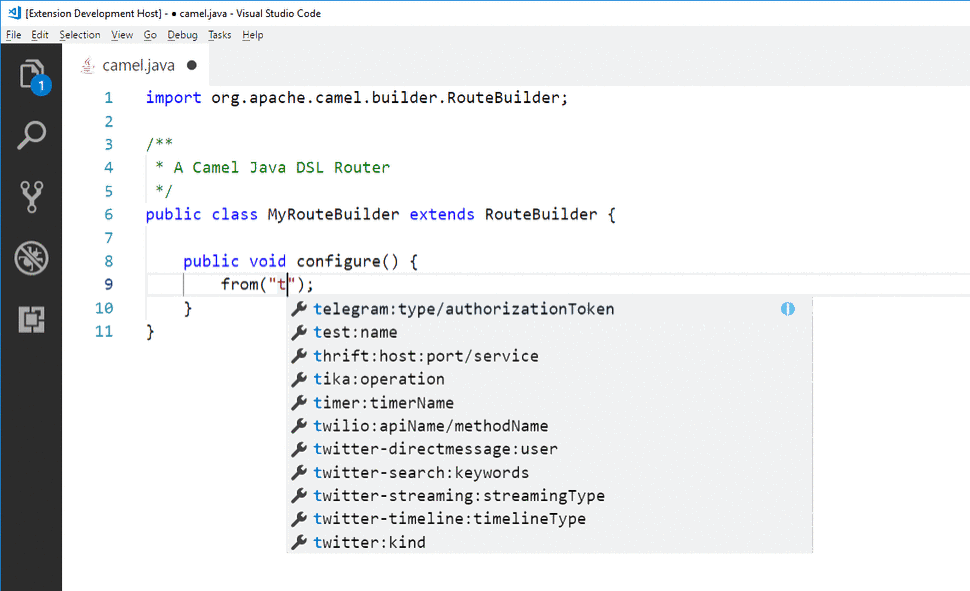
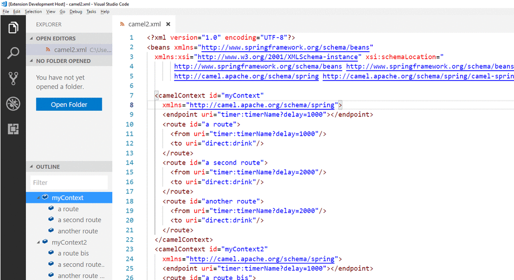

# Apache Camel for Visual Studio Code
This is a preview release of the [Visual Studio Code](https://code.visualstudio.com/) extension that adds [Apache Camel](http://camel.apache.org/) language support for XML DSL and Java DSL code.
  
When you add this extension to your installation of VS Code, the VS Code editor provides the following features:

For both XML DSL and Java:
* Language service support for Apache Camel URIs:
  * Auto-completion for Camel components, attributes, and the list of attribute values.
  
    
  
    
    
  * Quick reference documentation when you hover the cursor over a Camel component.
    
    
* Diagnostics for Camel URIs when you save a file.
    
    
For XML DSL only:
* Navigation to Camel contexts and routes.

* Auto-completion for referenced IDs of `direct`, `direct VM`, `VM` and `SEDA` components.

* Find references for `direct` and `direct VM` components in all open Camel files.

For detailed information about Apache Camel supported features, see the [Language Server GitHub page](https://github.com/camel-tooling/camel-language-server#features).

## Contact Us
If you run into an issue or have a suggestion, you can contact us by [creating a new issue on GitHub](https://github.com/camel-tooling/camel-lsp-client-vscode/issues).

## How to install
You can download this **Language Support for Apache Camel** extension from the Visual Studio Code Marketplace at https://marketplace.visualstudio.com/items?itemName=camel-tooling.vscode-apache-camel.

After you install VS Code, follow these steps:
1. In VS Code, select **View > Extensions**.
2. Search for **Camel**.
3. Select the **Language Support for Apache Camel** option and then click *Install*.

## Prerequisites for using this extension

After you install this **Language Support for Apache Camel** extension, follow these guidelines to access its features:
 
For XML DSL:
* You use an `.xml` file extension.
* You specify the Camel namespace http://camel.apache.org/schema/blueprint or http://camel.apache.org/schema/spring for the Camel element.

For Java DSL:
* You use a `.java` file extension. 
* You specify Camel (usually from an imported package). For example: `import org.apache.camel.builder.RouteBuilder`
* To reference the Camel component, use `from` or `to` and a string without a space. The string cannot be a variable. For example, `from("timer:timerName")` works but `from( "timer:timerName")` and `from(aVariable)` do not work.

